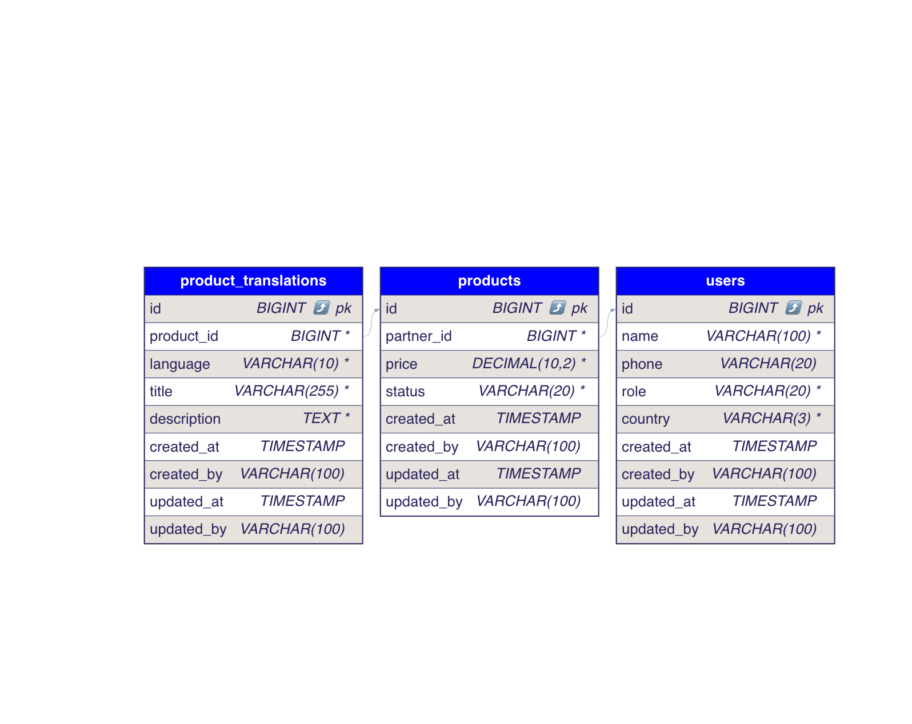
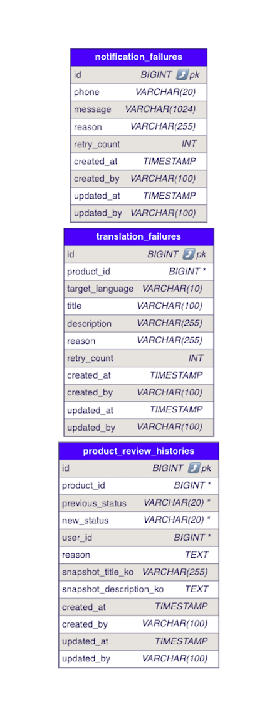
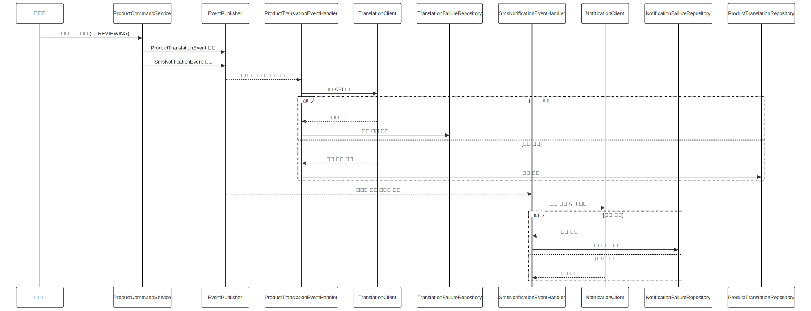
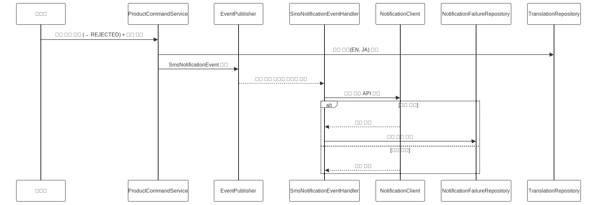
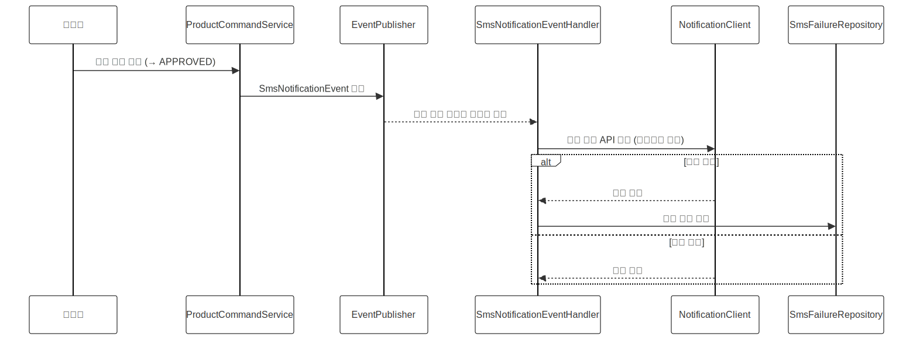
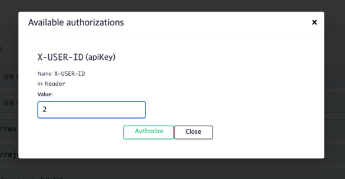

# ACON Multilingual Product Management API

다국어 기반 전자상거래 플랫폼 ACON에서  
상품의 등록, 상태 전이, 다국어 처리, 사용자 권한 기반 제어 등을 제공하는  
**상품 관리 백엔드 서버**입니다.

---

## 프로젝트 목적

- 상품 상태에 따라 다양한 사용자 권한을 분기하여 로직을 처리할 수 있어야 함
- 상품 정보를 다국어(한/영/일)로 관리하고, 외부 번역 API를 연동
- 작성 → 검토요청 → 검토중 → 승인/거절 → 재요청 → 판매 완료의 상태 전이 흐름 처리
- 외부 API 실패 대응을 위한 장애 복원 설계 포함 (Retry / 향후 동기식 통신에 한해, CircuitBreaker, Fallback 도 적용 가능)
- 고객은 선택한 언어에 맞게 상품을 조회할 수 있어야 함

---

## 사고의 흐름 및 구조 선택 이유

- 이 과제는 단순 CRUD를 넘어, 상태 전이, 사용자 역할 제어, 외부 API 연동, 장애 복원 등 **실무급 도메인 흐름**을 구현하는 것이 핵심이라고 판단하였습니다.
- 컨트롤러 → 서비스 → 도메인 → 이벤트/비동기 구조까지 **계층별 책임 분리**를 중심으로 설계하였습니다.
- 외부 API 실패 대응은 실패 로그를 남기고 스케쥴러를 통해 재처리하여 단순하면서도 효과적인 복원 구조를 도입하였습니다. 
- 무한 재시도를 방지하기 위해, 재시도 횟수를 5회로 제한하는 안전 장치를 추가했습니다.

---

## 폴더 구조 및 아키텍처 설계

```bash
com.carpenstreet
├── application           # 컨트롤러, 서비스 계층 (요청 처리)
│   ├── product
│   └── user
├── domain                # 핵심 도메인 모델 (Entity, Repository)
│   ├── product
│   └── user
├── client                # 외부 API 연동 (번역, 문자)
├── common                # 공통 예외, 응답 포맷
├── config                # 설정 관련 모듈
└── CarpenstreetApplication.kt
```

확장성을 고려한 설계 구조로, 도메인/계층 분리를 통해 멀티모듈/마이크로서비스 전환에 대비했습니다.

<details>
<summary>멀티모듈 확장 예시</summary>

```bash
modules/
├── product-api          ← application.product.*
├── product-domain       ← domain.product.*
├── user-api
├── user-domain
├── client-external      ← client.*
├── common-lib           ← common.*, config.*
```

</details>

<details>
<summary>MSA 분리 예시</summary>

- product-service
    - /product-api (외부 요청 처리)
    - /product-core (domain + repository + 상태 전이)
- user-service
    - /user-api (회원 관리)
    - /auth-service (JWT 인증 등)
- external-service
    - /translation-service (번역 요청 처리)
    - /notification-service (SMS 전송 등)

</details>

## ERD 및 UML 다이어그램




- 전체 DDL 및 DML은 /init 폴더에서 확인하실 수 있습니다.

### 시퀀스 다이어그램

- 검토 요청 → 검토 중 : 비동기 흐름, 외부 API 연동



- 검토 중 → 거절 : 번역 삭제 + 문자 발송 + 상태 전이



- 검토 중 → 완료 : 문자 발송 + 상품 판매 상태



## 설계 전략 및 고려사항

1. 상태 전이 모델링
   - ProductStatus는 enum + transition map 기반으로 유효성 검사 처리
   - 상태에 따라 수정/조회/전환 가능 여부가 달라지도록 명확하게 분리

2. 외부 API 연동 설계
   - TranslationClient, NotificationClient를 통해 외부 API 분리
   - 이벤트 기반 처리 + 실패 이력 저장 + 스케줄러 재시도로 복원성 보장

3. 계층적 구조 분리
   - application / domain / client / scheduler 계층을 나누어 유지보수성과 재사용성 확보
     - application: 요청 처리, 트랜잭션 단위 조합 및 이벤트 발행
     - domain: 상태 전이, 정책 판단, 핵심 로직 처리 책임
     - client: 외부 API 통신 추상화 계층 (테스트 대체 가능하도록 설계)
     - scheduler : 실패 시 재처리 로직 담당 (향후 스케쥴러 서버 혹은 배치 서버로 이관 가능)
   - service 레이어는 가능하면 비즈니스 규칙 없이 orchestration 위주로 구성

4. 테스트 및 품질
   - 제한된 시간으로 인해, 컨트롤러 및 서비스 전반의 테스트는 작성하지 못했으나, 외부 API 통신 및 재시도 로직에 대한 테스트는 포함되어 있습니다.
   - 외부 API는 Mocking 및 Stub 구성으로 테스트 시 예외 상황까지 커버할 수 있도록 구성하였습니다.
   - 주요 상태 전이 (`REQUESTED` → `REVIEWING` → `REJECTED/APPROVED`) 흐름을 테스트 코드로 검증해보는 것이 다음 확장 목표입니다.

## 사용 기술

| Layer       | Tech                        |
|-------------|-----------------------------|
| Language    | Kotlin (JVM 21)             |
| Framework   | Spring Boot 3.x             |
| DB          | H2 (in-memory)              |
| Build       | Gradle (Groovy)             |
| Test        | JUnit5                 |

## 실행 및 테스트 방법 

```bash
./gradlew clean build
./gradlew bootRun
```

- 접속: http://localhost:8080
- H2 Console: http://localhost:8080/h2-console (JDBC URL: jdbc:h2:mem:testdb)
- API Docs : http://localhost:8080/swagger-ui/index.html
  -  
  - 작가 권한 API 테스트의 경우 : X-USER-ID 값에 1를 넣어주시면 됩니다. 
  - 어드민 권한 API 테스트의 경우 : X-USER-ID 값에 2를 넣어주시면 됩니다. 
  - 유저 권한 API 테스트의 경우 : X-USER-ID 값에 3를 넣어주시면 됩니다.

### 페이지네이션 테스트 방법

- 목록 조회 API 예시입니다. sort = createdAt,desc / createdAt,asc 등으로 내림차순, 오름차순 정렬 가능합니다.

```bash
curl -X 'GET' \
  'http://localhost:8080/admin/products?status=REQUESTED&page=0&size=10&sort=createdAt,desc' \
  -H 'X-USER-ID: 2'
```

## 가정사항 / 특이사항

- 로그인/인증은 생략하고 UserContext로 시뮬레이션 처리
- 번역 API는 실제 호출 없이 ${text}${language} 형태로 응답하는 Mock 처리
- 문자 메시지 API는 실제로는 로그 출력 및 실패 이력 저장 구조로 처리
- 고객의 언어 선택은 /products?lang=ko|en|ja 형식의 쿼리 파라미터 기반

## 구조적 한계 및 향후 개선 방향

현재 구조는 Spring의 @EventListener 기반 비동기 이벤트와 Scheduler를 활용하여 외부 API 실패를 재처리합니다.

- 장점
  - 외부 API 실패가 메인 로직에 영향을 주지 않음
  - 단순하고 빠른 구현이 가능
-  단점
    - 이벤트/스케줄러가 분리되어 있어 실패 추적이 불명확
    - 재처리 실패에 대한 후속 조치(DLQ, 알림 등) 없음
    - 순서 보장, 중복 처리 방지 등은 미지원

### 향후 개선 제안 (운영 환경 고려)

현 구조는 `@EventListener` + `Scheduler` 기반의 단순한 복원 처리 방식이지만,  
운영 환경에서 Kafka 기반의 이벤트 아키텍처(EDA)를 사용하고 있다면, 다음과 같은 확장도 고려할 수 있습니다.

| 항목 | 현재 방식 | 확장 방향 |
|------|-----------|-----------|
| 비동기 이벤트 처리 | `@EventListener` + `@Async` | Kafka Producer + Outbox Pattern |
| 장애 추적 | 실패 이력 DB 저장 | DLQ(Kafka Dead Letter Queue) 저장 |
| 재처리 방식 | Scheduler 기반 재시도 | Kafka Retry Topic 또는 Consumer Retry |
| 메시지 전송 방식 | 내부 이벤트 기반 | Kafka 이벤트 기반 전파 (Notification Service 등) |

> 현재 구조는 Event Handler를 추상화하여 추후 Kafka Publisher로의 교체가 용이하도록 설계되어 있으며,  
> `TranslationClient`, `NotificationClient` 또한 분리된 외부 모듈 구조로 MSA 분리에 적합한 구조입니다.

## 확장 가능성 (멀티모듈/MSA)

- 도메인 단위(product, user), 계층 단위(domain, application, client, scheduler)를 분리하여 추후 기능별 모듈화 또는 서비스화(MSA)로 쉽게 전환 가능
- external-service는 실제 마이크로서비스로 분리 가능하도록 인터페이스화
- common 패키지는 공통 유틸/예외처리 모듈로 독립 배포도 가능

## 시행착오 및 피드백

1. TranslationClient 비동기 실패 처리 누락 → 재시도 불가 문제
- 문제: 번역 API 호출 실패 시, 아무 처리 없이 예외만 발생하고 종료됨
- 원인: @Async @EventListener에서 실패 시 예외 전파가 swallow되며 누락됨
- 해결: 실패 정보를 TranslationFailureEntity에 저장하고, 별도 Scheduler에서 재시도 구조로 분리
- 교훈: 비동기 로직에서 실패 추적이 되지 않으면 무한 장애로 이어질 수 있으므로 반드시 로그 or 실패 저장 + 재처리 구조 필요 

2.️ UserContext NullPointerException (테스트 환경)

  - 문제: 테스트 실행 중 UserContext.get() 호출 시 NPE 발생
  - 원인: ThreadLocal 기반의 컨텍스트가 명시적으로 set()되지 않은 상태에서 사용됨
  - 해결: 테스트 시작 전 UserContext.set(mockUser)을 명시적으로 호출
  - 교훈: ThreadLocal 기반은 테스트에 매우 취약하므로 반드시 명시적으로 초기화해야 하며, Spring Security 기반 구조에서는 AuditorAware를 활용하는 것이 안전함

3. TransientPropertyValueException (엔티티 저장 순서 오류)

- 문제: ProductEntity 저장 시 partner가 Transient 상태라 예외 발생
- 원인: UserEntity를 먼저 저장하지 않고 참조만 한 상태로 상품 저장 시도
- 해결: UserRepository.save()를 먼저 호출 후, ProductEntity.partner에 할당
- 교훈: JPA의 cascade, 영속성 컨텍스트, 연관관계 저장 순서를 정확히 이해하고 있어야 함

4. 상품 상세 조회 시 권한 체크 누락

- 문제: 고객이 상태가 APPROVED가 아닌 상품도 모두 조회 가능
- 원인: 권한 체크 없이 모든 상품에 접근 허용
- 해결: UserRole 기반 접근 제어 추가 (고객은 APPROVED만 조회 가능 / 작가는 자신의 상품 또는 APPROVED만)
- 교훈: API 설계 시 권한 분기 로직은 모든 read/write 에 대해 명시적 방어 코드가 필요

5. 이벤트 기반 구조 테스트 불가 문제

- 문제: @EventListener + @Async 구조는 테스트에서 이벤트 핸들러 동작 확인이 어려움
- 원인: 테스트에서는 이벤트 퍼블리싱이 비동기적으로 작동하여 assertion 시점이 보장되지 않음
- 해결: 핸들러를 별도 메서드로 분리하고 테스트에서는 직접 메서드를 호출하여 확인
- 교훈: 이벤트 핸들러는 핵심 로직과 분리하여 재사용 가능하게 구성해야 테스트 및 유지보수에 유리

6. 다국어 데이터 미존재 시 NPE 발생

- 문제: 상품의 특정 언어 번역 정보가 존재하지 않으면 findByProductIdAndLanguage()가 null 반환
- 원인: 초기 번역 데이터 미생성 + null 체크 누락
- 해결: 번역이 없을 경우 생성/초기화 로직 추가
- 교훈: 외부 연동 기반 다국어 데이터는 조회 실패를 전제로 null-safe 설계가 필요

7. 무한 재시도 구조 (스케줄러)

- 문제: 실패 이력 재시도 구조에서 retryCount 제한이 없어서 무한 재시도 발생 가능
- 원인: retryCount 조건 분기 없이 모든 실패 이력을 반복 처리
- 해결: 5회 이상 시 재시도 대상 제외 + Slack 알림 연동 준비 (현재는 로그만)
- 교훈: 모든 재시도 로직에는 idempotent 보장 + 재시도 제한 조건을 명확히 걸어야 운영 리스크를 방지할 수 있음

## 기타 기술적 고려

- 본 프로젝트는 인증 시스템이 없는 상태에서 진행되었으며,  실제 로그인/세션 처리는 구현 대상이 아니었기 때문에, 사용자 식별은 `UserContext` 기반의 시뮬레이션 처리로 대체하였습니다.
- 실제 운영 환경에서는 JWT 기반 인증 시스템과 Spring Security를 적용하여 사용자 정보와 권한을 추출하는 것이 좋습니다.

### UserContext 처리 방식

- 인증된 사용자(HTTP Header 의 X-USER-ID 값 확인)는 컨트롤러 진입 전 인터셉터를 통해 `UserContext.set(user)`로 저장되고 
- 이후 서비스 및 도메인 계층에서 `UserContext.get()`을 통해 사용자 정보를 접근합니다.
- 테스트 환경에서는 명시적으로 `UserContext.set(mockUser)`을 주입하여 테스트 수행이 가능하도록 구성하였습니다.

### Auditing 구조

- 생성자/수정자 정보 및 생성/수정 시점은 `BaseTimeEntity` + Spring Auditing 기능을 통해 자동으로 관리됩니다.
- 초기값 설정 시에는 `AuditorAware`에서 "system"이라는 기본값으로 사용자 ID를 대체하고 있습니다. 

### Country 필드 및 ISO 코드 도입 배경

사용자의 국적을 명시적으로 관리하기 위해 `country` 필드를 도입하고, 국가 식별은 국제 표준인 **ISO 3166-1 Alpha-2 코드(`KR`, `US`, `JP` 등)** 를 사용했습니다. 이는 다국적 사용자 기반 확장, 국가별 정책 분기(언어, 인증, 결제 등), SMS 발송 및 전화번호 포맷 처리와 같은 실무 요구사항을 유연하게 대응하기 위함입니다.

- 레퍼런스 : https://www.itu.int/rec/T-REC-E.164-201011-I/en

### Enum 설계 및 계층 간 사용 전략 

Enum은 도메인 중심으로 설계하되,  Controller와 같은 외부 계층에서 사용할 경우에는  의미가 과도하게 노출되지 않도록 **DTO 변환이나 포장 객체를 통해 안정적으로 노출**합니다. 
이는 도메인 변경이 외부 API에 영향을 주지 않도록 하기 위한 **계층 분리 원칙에 기반한 선택**입니다.

### 도메인 역할 기반 설계

products.partner_id는 users 테이블을 참조하지만, 도메인 상 명확한 역할 표현을 위해 partner_id로 명시하였습니다.

### 가격 필드 설계 이유 (price: DECIMAL)

금액 계산에서의 정밀도를 보장하기 위해 `FLOAT`/`DOUBLE`이 아닌 `BigDecimal`을 사용하였습니다.   
부동소수점 방식은 이진수 기반 근사 표현으로 인해 오차가 발생할 수 있으며, `BigDecimal` + `Decimal`은 이를 방지하기 위한 정확한 10진수 연산 방식을 제공합니다.

### NotNull 조건

Entity 간 연관관계는 `nullable = false`를 명시하여 JPA 레벨에서의 무결성도 보장합니다.  
이는 DB 제약 및 Kotlin 타입 안정성과 함께 3중 안전망을 구성하여, 예측 가능한 구조를 만듭니다.

### 상태 전이 설계 방식 비교 및 선택 이유

이번 과제에서는 `transitionMap` 기반으로 상품 상태 전이 흐름을 구현하였습니다.  
전이 조건이 복잡하지 않고, 명확한 요구사항 기반의 흐름 정의가 가능한 구조이므로  
간결하고 유지보수하기 쉬운 방식이 적절하다고 판단하였습니다.

다만, 추후 상태별로 전이 조건(예: 권한, 시간, 정책 등)이 복잡해지는 경우에는  
State Pattern(상태 클래스 기반 설계)으로 확장하는 것이 바람직합니다.

| 설계 방식 | 장점 | 단점 | 추천 상황 |
|-----------|------|------|-----------|
| `transitionMap` (현재 방식) | 간결하고 테스트 용이<br>Enum 기반으로 직관적<br>정책이 단순할 때 유리 | 권한, 컨텍스트 기반 전이 조건 반영 어려움 | 전이 흐름이 명확하고<br>상태 수가 적은 경우 |
| `State Pattern` | 상태별 전이 조건 내포 가능<br>권한/상황에 따라 유연한 처리 가능<br>테스트 및 유지보수에 강함 | 클래스 수 증가<br>Enum 기반 구조와 충돌<br>과도한 설계가 될 수 있음 | 상태별 전이 정책이 다양하고<br>복잡한 시스템인 경우 |


## 마무리하며

이번 과제는 기능을 단순 구현하는 것을 넘어서, **실제 운영 가능한 아키텍처 수준의 구조화된 설계**에 집중하였습니다.

- 상태 전이 로직의 안전성
- 외부 API 연동의 복원력
- 비즈니스 도메인의 명확한 책임 분리

이 모든 것을 중심에 두고 설계하고 구현하였습니다.